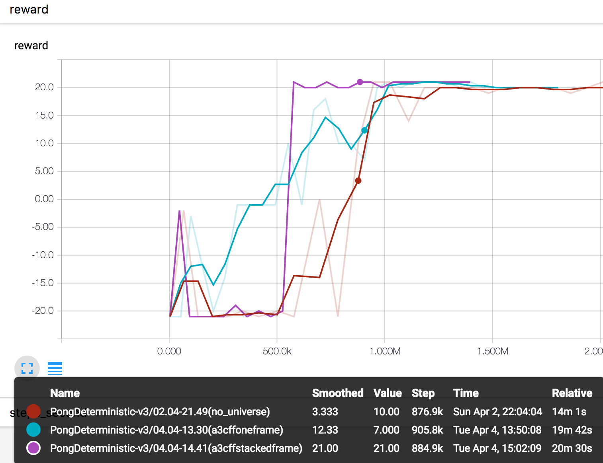
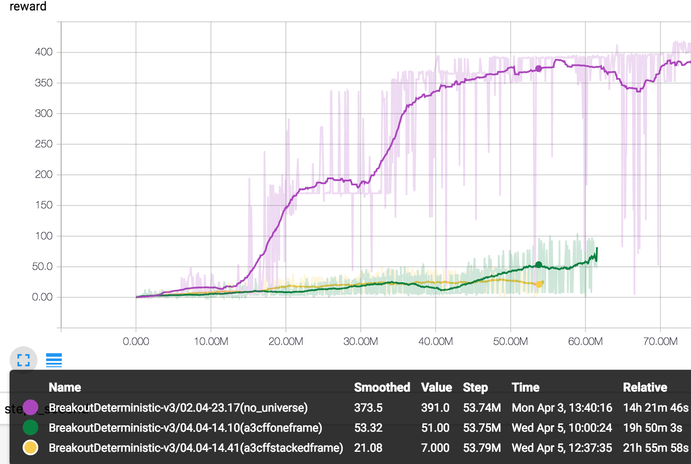

# Bombora
My various ongoing experiments with RL originally based on [ikostrikov/pytorch-a3c](https://github.com/ikostrikov/pytorch-a3c).

If you want to get started with A3C check out [ikostrikov/pytorch-a3c](https://github.com/ikostrikov/pytorch-a3c) or for more extensive implementations in tensorflow refer to [steveKapturowski/tensorflow-rl](https://github.com/steveKapturowski/tensorflow-rl).


### Usage
```
OMP_NUM_THREADS=1 python main.py --env-name "PongDeterministic-v3" --algo a3c --num-processes 16
```

This code runs evaluation in a separate thread in addition to 16 processes.

Now you can run tensorboard and watch it training.

```
tensorboard --logdir runs
```

Videos of a game is also saved every `--rec-every-nsteps`, you can check them in `checkpoints` directory.


### Dependencies
   * pytorch
   * torchvision
   * gym
   * [tensorboard logger](https://github.com/TeamHG-Memex/tensorboard_logger)

Note:
Pytorch is still in beta and non recent version might have some problem.
### Results
___
It seems "a3cff" has problem with slightly harder games as of now.
(no_universe is a label for LSTM)
##### Pong



### Credits

Cheers to [Pytorch](http://pytorch.org) and authors of the follwing repos:
   
   * [ikostrikov/pytorch-a3c](https://github.com/ikostrikov/pytorch-a3c)
   * [steveKapturowski/tensorflow-rl](https://github.com/steveKapturowski/tensorflow-rl)

